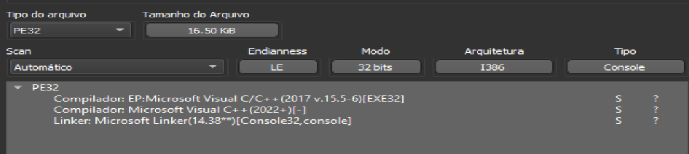
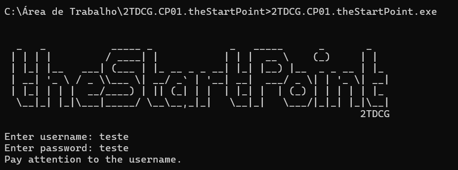
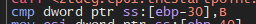
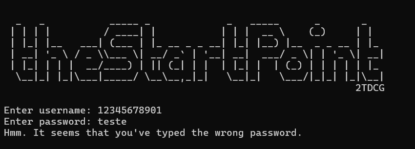
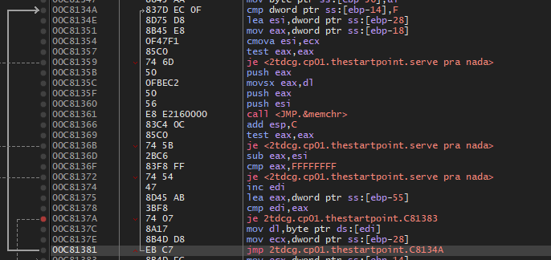
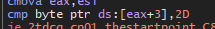

# FIAP - 1° Checkpoint - Análise de Malware

## Introdução
Checkpoint realizado com o intuito de colocar em prática todos os conhecimentos sobre análise de malwares na matéria de Malware Analysis, ministrada pelo [Professor Charles Lomboni](https://www.linkedin.com/in/charleslomboni/).

## Feito por

- Matheus Rosa

## Credenciais usadas para solução

USER: matheusrosa

PASS: mat-eusrosa

# Write Up

## 1. DIE

Utilizei o DIE para ver mais informações osbre o executavel, ver sua estrutura e se havia proteções.

## 2. Abri pelo CMD

Como o programa fechava e nem se quer mostrava alguma mensagem de erro, abri pelo cmd.

## 3. Abri o x32dbg e procurei pela a string de erro mostrada no cmd

## 4. Primeira Analise

Logo depois de inserir a senha ele pula para uma função que compara a entrada do user com o valor B 

Transformando "B" em decimal, ficaria 11. 

Logo, a entrada do user precisa ter 11 caracteres. 

## 5. Segundo erro

Testando com uma senha de 11 caracteres e chutandoa a senha aparece esse erro 

Fazendo a mesma coisa de ir atras da string e tal encontrei duas validações

## 7. Segunda Analise

Primeira coisa que notei foi que ao inserir a senha o valor vai diretamente para eax

e depois vem a primeira validação em formato de loop

## 8. Primeira Validação - LOOP

Basicamente é um loop onde compara eax com edi e incrementa o edi ate ficarem iguais

## 9. Segunda Validação - LOOP

A segunda validaçãose trata de um compare entre eax+3 e com o valor hexa 2D.

| Hexa-decimal  |  ASCII        |
| ------------- | ------------- |
| 2D            | -             |
| eax           | Password      | 

Convertendo os valores para melhor entendimento: 
2D -> ( - ) ífen em ascii
eax - seria o unput do password

eax+3 seria o 4 caracter da senha digitada.
Sendo assim, o quarto caracter precisa ser um ífen

## 10. Bypassando Validações

