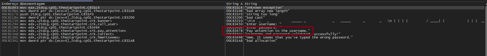
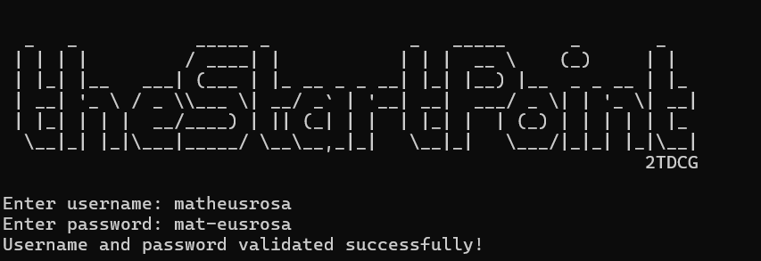

# FIAP - 1° Checkpoint - Análise de Malware

## Introdução
Checkpoint realizado com o intuito de colocar em prática todos os conhecimentos sobre análise de malwares na matéria de Malware Analysis, ministrada pelo [Professor Charles Lomboni](https://www.linkedin.com/in/charleslomboni/).

## Feito por

- Matheus Rosa

## Credenciais usadas para solução

USER: matheusrosa

PASS: mat-eusrosa

# Write Up

## 1. DIE

Utilizei o DIE para ver mais informações sobre o executável, ver sua estrutura, se tinha proteções, etc.

## 2. CMD

Como o programa fechava e nem se quer mostrava alguma mensagem de erro, abri pela Command Line.

## 3. x32dbg

Abri o debugger e a primeira coisa que fiz foi procurar pela string de erro que vi no cmd. 

## 4. Primeira Análise

Logo depois de inserir a senha o programa pula para uma função que compara a entrada do user com o valor B 

Transformando "B" em decimal, fica 11. 

Logo, a entrada do user precisa ter 11 caracteres. 

## 5. Segundo erro

Testando com um user de 11 caracteres e chutando a senha apareceu uma mensagem de erro diferente 

Fazendo a mesma coisa de ir atrás da string e encontrei duas validações

## 7. Segunda Analise

Primeira coisa que notei foi que ao inserir a senha o valor vai diretamente para eax

Depois vem a primeira validação em formato de loop.

## 8. Primeira Validação - LOOP

Basicamente é um loop onde compara eax com edi e incrementa o edi até ficarem iguais

## 9. Segunda Validação - LOOP

A segunda validação se trata de um compare entre eax+4 e com o valor hexa 2D.

| Hexa-decimal  |  ASCII        |
| ------------- | ------------- |
| 2D            | -             |
| eax           | Password      | 

Convertendo os valores para melhor entendimento: 
2D -> ( - ) ífen em ascii
eax - seria o unput do password

eax+3 seria o 4 caracter da senha digitada.
Sendo assim, o quarto caracter precisa ser um ífen

## 10. Bypassando Validações

